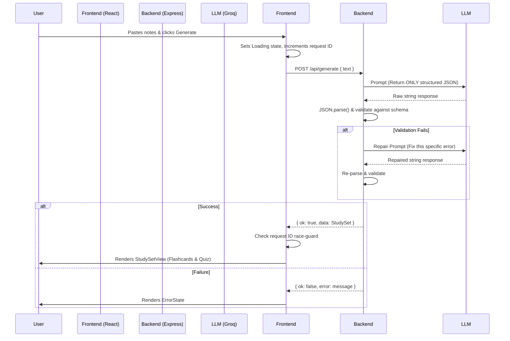

# Study Assistant

**Live Demo:** [https://study-assistant-m0zc.onrender.com/](https://study-assistant-m0zc.onrender.com/)
A modern, robust web application that transforms unstructured notes into interactive flashcards and quizzes using AI.

Built for the **Flam Frontend Internship Assignment**.

## Project Overview

This project focuses on delivering a production-grade frontend experience. It consists of a React (Vite) frontend and a thin Node.js/Express backend that acts as a secure proxy to the Groq LLM API. 

The application takes raw text input, securely proxies it through the backend to generate a structured JSON study set (Flashcards + Quiz), and renders an interactive, beautifully designed UI for the user to study and retest themselves.

### Key Features
- **Instant Generation**: Paste text and instantly receive a structured study set.
- **Interactive Flashcards**: Hardware-accelerated 3D CSS flip animations.
- **Smart Quizzes**: Multiple-choice quizzes with immediate feedback and explanations.
- **Adaptive Retesting**: Filter and re-test only the questions you got wrong without requiring a new API call.
- **Modern SaaS UI**: Clean, minimal design using Tailwind CSS (Zinc scale), smooth transitions, and polished empty/loading/error states.
- **Robust Error Handling**: Client-side race-condition guards (via `useRef`), request timeouts (via `AbortController`), and backend LLM repair-retry logic.

## Architecture & Data Flow



## Setup Instructions

### Prerequisites
- Node.js (v18+ recommended)
- A [Groq API Key](https://console.groq.com/keys)

### 1. Clone the repository
```bash
git clone https://github.com/Harsha-Vardan/Study_Assistant.git
cd study-assistant
```

### 2. Backend Setup
The backend runs on port 3001.
```bash
cd backend
npm install
```
Create a `.env` file in the `backend/` directory:
```env
GROQ_API_KEY=your_groq_api_key_here
PORT=3001
```
Start the backend server:
```bash
npm run dev
```

### 3. Frontend Setup
The frontend runs on port 5173 (Vite default).
Open a new terminal window:
```bash
cd frontend
npm install
npm run dev
```
Open `http://localhost:5173` in your browser.

## Tech Stack
- **Frontend**: React, Vite, Tailwind CSS v4
- **Backend**: Node.js, Express
- **AI**: Groq SDK (`llama-3.3-70b-versatile` model)

## Known Limitations
1. **Context Window**: Extremely long text pastes might exceed the LLM's context window. (Currently handled by standard error boundary).
2. **Stateless**: The app currently does not persist study sets to a database. Refreshing the page clears the current study set.
3. **LLM Hallucinations**: While strict JSON formatting prompts and validation loops are in place, the LLM might occasionally produce slightly inaccurate explanations based on ambiguous notes.

## AI Usage Note
This project was developed through pair-programming with Antigravity (Google DeepMind AI). The AI assisted heavily in scaffolding the Vite setup, writing boilerplate Tailwind utilities, implementing the 3D CSS flip animations, and structuring the `AbortController` and race-guard logic. All architecture decisions, component hierarchies, and strict PRD adherence were driven iteratively.
